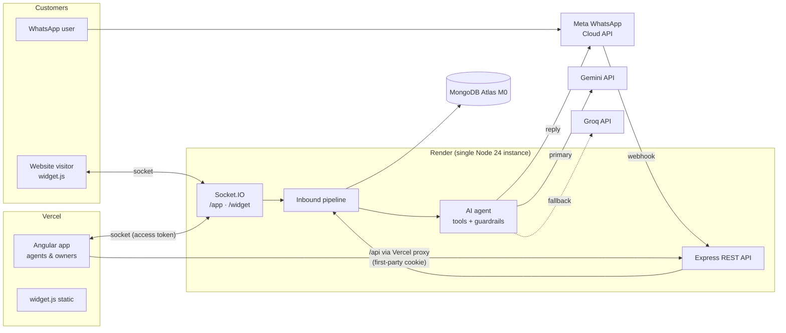
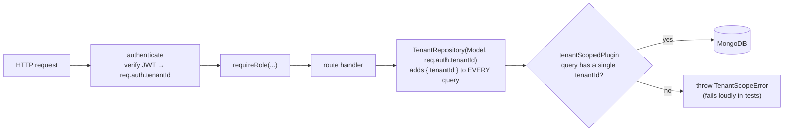

# ConvoDesk

**A multi-tenant AI inbox + mini-CRM.** Businesses configure an AI agent, connect a web chat widget and
WhatsApp, and handle every customer conversation from one real-time shared inbox. The AI answers,
captures leads and books slots, and a human can take over at any moment.

Built on the MEAN stack with TypeScript end to end. It runs entirely on free tiers.

> **Live demo:** _coming in Phase 10_ · **Screenshots:** _coming in Phase 9_

[](https://github.com/Brajesh250/convodesk/actions/workflows/ci.yml)

---

## The problem

Small businesses get customer messages on several channels and can't staff them around the clock.
Generic chatbots either hallucinate promises ("sure, full refund!") or dead-end the customer. ConvoDesk
puts a **guard-railed** AI agent in front, with a **one-click human takeover**, and turns good
conversations into **leads, tickets and bookings**.

## Architecture



## Tenant isolation

Every tenant-owned document has an indexed, immutable `tenantId`. Isolation is enforced in two layers
(full reasoning in [ADR-008](docs/DECISIONS.md)):



- The tenant always comes from the **verified token**, never from the URL or body. That's why the API
  has `/api/tenant`, with no id to tamper with.
- Another tenant's record returns **404** (not 403), so ids don't reveal that a record exists.
- `server/src/modules/tenant-isolation.test.ts` proves over HTTP that tenant A can't read or modify
  tenant B's users, invites or settings, and that RBAC is enforced on the server.

## Auth in one paragraph

Signup creates a Tenant and its OWNER in one transaction. The API returns a **15-minute access token**
(the SPA keeps it in memory) and sets a **rotating refresh token** in an httpOnly cookie scoped to
`/api/auth`, stored server-side only as a hash. Replaying an old refresh token revokes the whole
session family. Owners invite teammates with single-use links. The token sits in the URL `#fragment`,
so it never reaches server logs. Roles are OWNER, AGENT and VIEWER, checked by `requireRole()` on the
server and mirrored in the UI.

_Detailed sections are added as each phase lands:_

| Topic                           | Where / Phase |
| ------------------------------- | ------------- |
| Data model diagram              | Phase 3       |
| Channel adapter design          | Phase 5 / 7   |
| LLM fallback design             | Phase 6       |
| Free-tier trade-offs and limits | Phase 10      |

Design decisions are in [`docs/DECISIONS.md`](docs/DECISIONS.md). Production incidents are written up in
[`docs/INCIDENTS.md`](docs/INCIDENTS.md).

## Repository layout

```
shared/   zod schemas + enums → types used by every package
server/   Express 5 + Mongoose + Socket.IO API
client/   Angular 22 app (standalone components, signals, Material)
widget/   embeddable chat widget (vanilla TS, one <script> tag)
docs/     ADRs, incident postmortems, deploy guide
```

## Run locally

Requirements: Node 24 (`nvm use`) and a MongoDB (local `mongod` or a free Atlas cluster).

```bash
npm install                 # installs all workspaces and builds `shared`
cp .env.example .env        # then set MONGODB_URI
npm run dev:server          # API on http://localhost:4000 (GET /health)
npm run dev:client          # Angular on http://localhost:4200
npm run dev:widget          # widget test page on http://localhost:5173
```

## Tests and quality gates

```bash
npm run lint        # ESLint (server/shared/widget + angular-eslint for client)
npm run typecheck   # tsc --noEmit in every workspace
npm test            # Vitest; server tests use an in-memory MongoDB replica set
npm run build       # production builds of all packages
```

CI runs the same steps on every push and pull request. See `.github/workflows/ci.yml`.

## License

MIT
